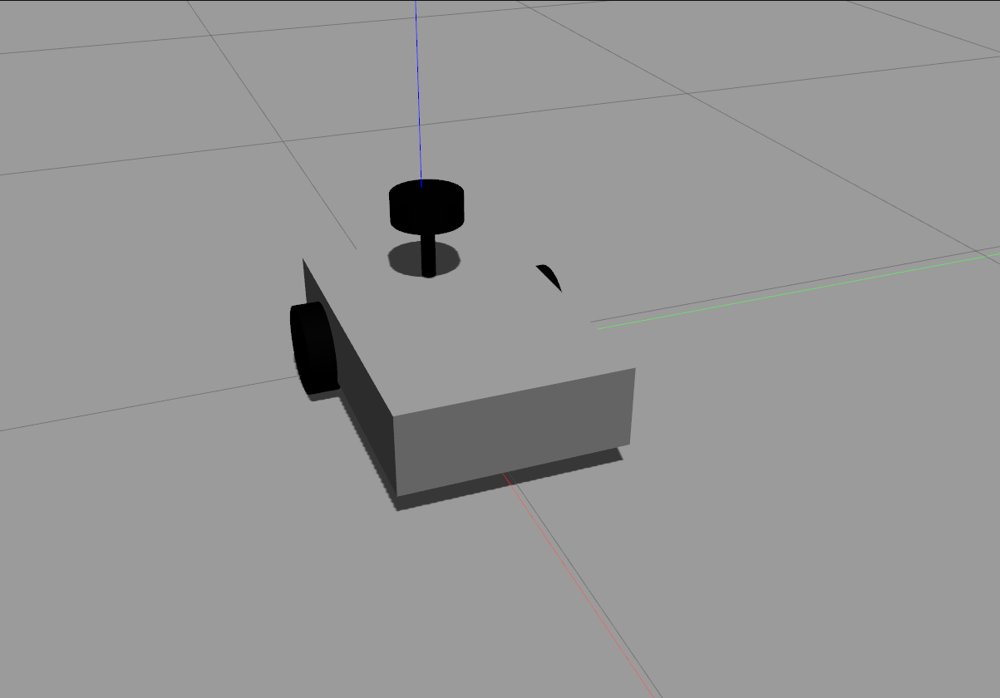

# Speedy Duck Robot



The Speedy Duck is a versatile robot designed for Simultaneous Localization and Mapping (SLAM), path planning, and navigation tasks. It is a differential drive robot that utilizes ROS 2 (Foxy), the Nav2 stack, and ROS 2 Control. The robot can operate both in simulation using Gazebo and in real-life using a Raspberry Pi.

## Features

- SLAM: The Speedy Duck robot performs SLAM to create a map of its environment. 
- Path Planning: It utilizes the Nav2 stack to plan efficient paths for reaching goals.
- Navigation: The robot autonomously navigates through its environment using the planned paths.
- Differential Drive: The Speedy Duck has a differential drive system for smooth and precise movement.
- ROS 2 (Foxy): The codebase is built on ROS 2, which provides improved performance and reliability.
- ROS 2 Control: It utilizes the ROS 2 Control framework for hardware and motor control.

## Installation

### Prerequisites

- ROS 2 (Foxy)
- Gazebo (for simulation)
- Raspberry Pi (for real-life deployment)

### Dependencies

Make sure to install the following dependencies before building the Speedy Duck robot:

```bash
 sudo apt install ros-foxy-xacro
 sudo apt install ros-foxy-joint-state-publisher-gui
 sudo apt install ros-foxy-rplidar-ros
 sudo apt install ros-foxy-gazebo-ros-pkgs
 sudo apt install ros-foxy-ros2-control ros-foxy-ros2-controllers
 sudo apt install ros-foxy-navigation2 ros-foxy-nav2-bringup ros-foxy-turtlebot3
 ```
 
 ### Build

 Follow these steps to build the Speedy Duck robot:

 1- inside src directory in your ros2_ws
 ```bash
 git clone https://github.com/speedy_duck/speedy_duck.git
colcon build --pacakges-select speedy_duck duck_navigation --symlink-install 
ros2 launch speedy_duck launch_sim.launch.py
 ```
for real robot
```bash
git clone https://github.com/joshnewans/serial
git clone https://github.com/joshnewans/diffdrive_arduino
git clone https://github.com/CreedyNZ/rplidar_ros2.git
ros2 launch speedy_duck launch_robot.launch.py
```
