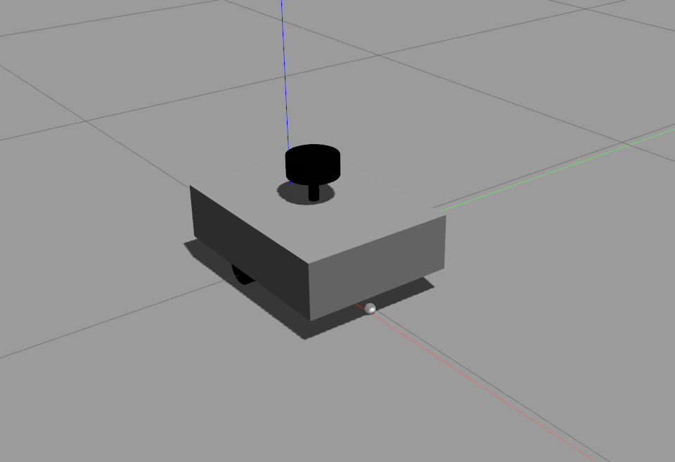
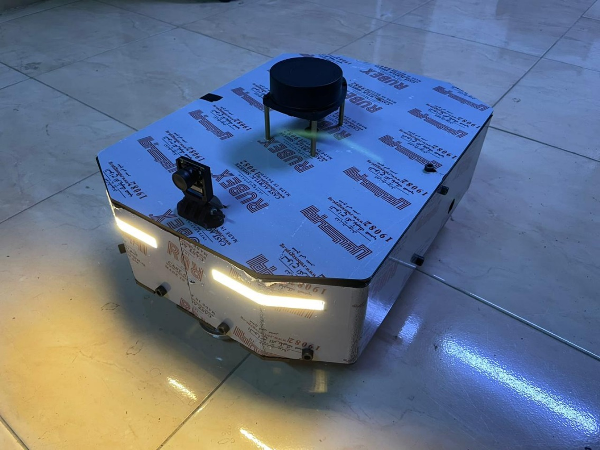
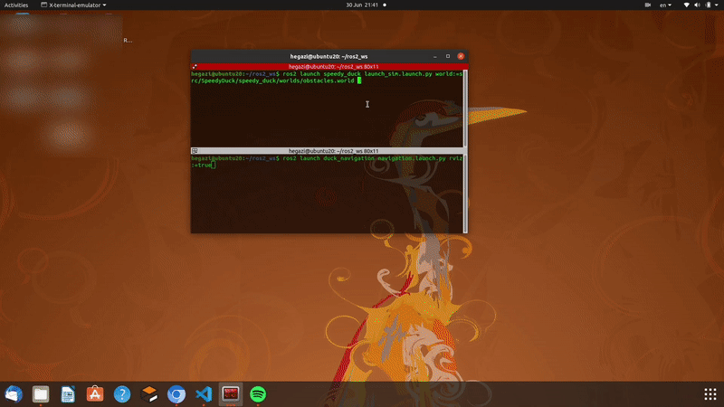
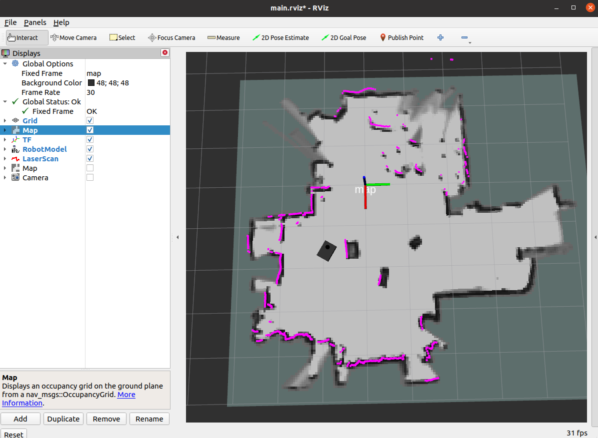
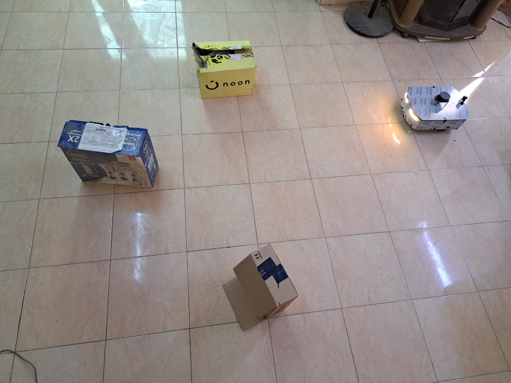

# 1. Speedy Duck Robot

<table>
  <tr>
    <td>
      
    </td>
    <td>
      
    </td>
  </tr>
</table>

The Speedy Duck is a versatile robot designed for Simultaneous Localization and Mapping (SLAM), path planning, and navigation tasks. It is a differential drive robot that utilizes ROS 2 (Foxy), the Nav2 stack, and ROS 2 Control. The robot can operate both in simulation using Gazebo and in real-life using a Raspberry Pi.

#  2. Features

- SLAM: The Speedy Duck robot performs SLAM to create a map of its environment.
- Path Planning: It utilizes the Nav2 stack to plan efficient paths for reaching goals.
- Navigation: The robot autonomously navigates through its environment using the planned paths.
- Differential Drive: The Speedy Duck has a differential drive system for smooth and precise movement.
- ROS 2 (Foxy): The codebase is built on ROS 2, which provides improved performance and reliability.
- ROS 2 Control: It utilizes the ROS 2 Control framework for hardware and motor control.

# 3. Installation

## 3.1. Prerequisites

- ROS 2 (Foxy)
- Gazebo (for simulation)
- Raspberry Pi (for real-life deployment)

## 3.2. Dependencies

Make sure to install the following dependencies before building the Speedy Duck robot:

```bash
 sudo apt install ros-foxy-xacro
 sudo apt install ros-foxy-joint-state-publisher-gui
 sudo apt install ros-foxy-rplidar-ros
 sudo apt install ros-foxy-gazebo-ros-pkgs
 sudo apt install ros-foxy-ros2-control ros-foxy-ros2-controllers
 sudo apt install ros-foxy-navigation2 ros-foxy-nav2-bringup
 ```
  # 4. Build

 Follow these steps to build the Speedy Duck robot:

 inside src directory in your ros2_ws
 ```bash
 git clone https://github.com/speedy_duck/speedy_duck.git
 cp -r SpeedyDuck/* .
 rm -rf SpeedyDuck
 cd ..
colcon build --pacakges-select speedy_duck duck_navigation --symlink-install 
 ```

# 5. Run
```bash
ros2 launch speedy_duck launch_sim.launch.py rviz:=false world:=~/ros2_ws/src/speedy_duck/worlds/obstacles.world
## Change ros2_ws to the name of your workspace  
## Use launch_robot instead of launch_sim if you're using real robot and remove world param
ros2 launch duck_navigation navigation.launch.py rviz:=true
 ```
 ## 5.1. For real robot
 in src directory of your ros2_ws:
 ```bash
 git clone https://github.com/joshnewans/serial
git clone https://github.com/joshnewans/diffdrive_arduino
git clone https://github.com/CreedyNZ/rplidar_ros2.git
cd ..
colcon build --symlink-install
 ```

 


 <span style="font-size:medium;">**For Arduino**</span>, use this [code by joshnewans](https://github.com/joshnewans/ros_arduino_bridge/tree/main).


# 6. Gotchas

1- You need to run the launch_sim launch file first (or launch_robot if you'r working on real robot).
Wait until controller nodes are working(you will see some collered messages saying:
Configured and started joint_broad
Configured and started diff_cont
) Then now you can launc navigation file.

2- Path planning depends on [behavior.xml](duck_navigation/config/behavior.xml) which is called in [bt_navigator.yaml](duck_navigation/config//bt_navigator.yaml), so change the line ```default_bt_xml_filename``` to be file's path on your machine.

3- when you create a new map you need to save inside [config directory](duck_navigation/config/) then you need name of file called in the map server node in [navigation.launch.py](duck_navigation/launch/navigation.launch.py).

4- you can create your own map by launching the sim then launch mapping_sim launch file, when you feel you are ready to save the map open new terminal and navigate to the config directory inside duck_navigation package then use this line:
```bash
ros2 run nav2_map_server map_saver_cli -f <name_of_your_new_map>
``` 
**<span style="color: red;">Important!!</span>** 5- When you use real robot I recommend you to connect to raspberrypi using ssh and launch robot, then launch navigation using the terminal of your pc (don't use raspberrypi's terminal). By doing that you're using ROS2 amazing built in feature that makes all machines in the same network share the same topics.
Now you can use rviz to visualise your real robot on your pc.


<span style="font-size:larger;">Sim</span>




<span style="font-size:larger;">Real robot</span>

<table>
  <tr>
    <td>
      
    </td>
    <td>
      
    </td>
  </tr>
</table>


